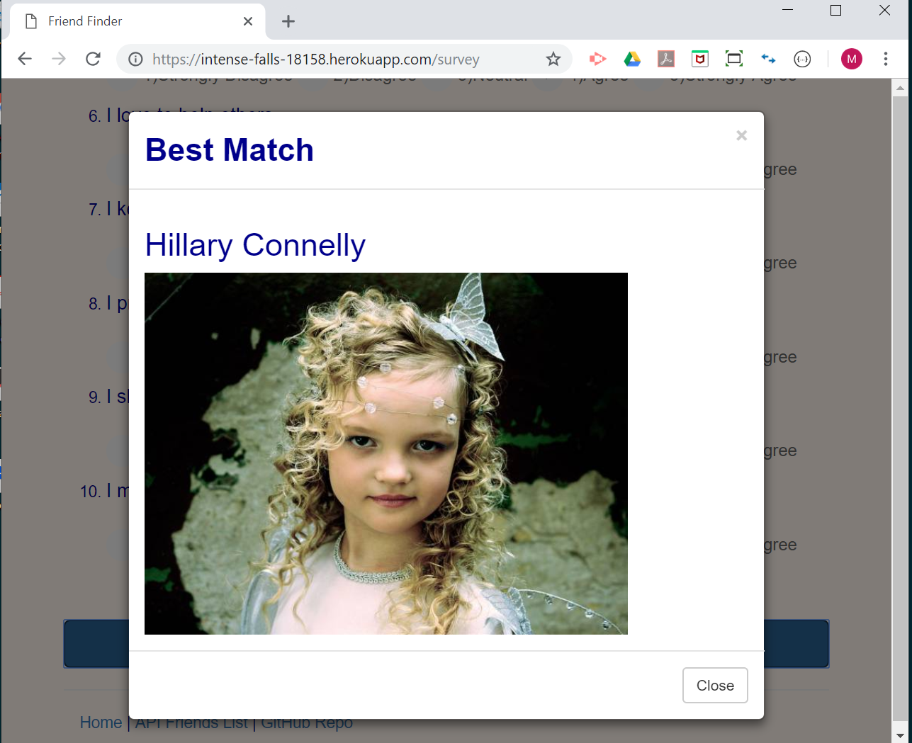

# Friend Finder - Node and Express Servers

### Overview

This "FriendFinder" application is basically a dating app based on personality compatibility via survey. The app will take in users' answers from the surveys, and it will compare their answers with those from other users. Then, it will display the name and picture of the user with the best overall match.

This full stack web site app Express(Node.js) to handle routing to serve various endpoints. It is deployed at Heroku.

### Deployment and Availability

* Heroku
  * Live app - https://intense-falls-18158.herokuapp.com
* GitHub
  * Repository - https://mmakino.github.io/FriendFinder

### Intallation

* This full stack app can also be installed __locally__ through the following steps 

1. Copy / Clone the git repository
    ```
    git clone https://github.com/mmakino/FriendFinder.git
    ```
1. Install necessary packages
    ```
    npm install
    ```
1. Start the web server
    ```
    node server.js
    ```
    * It should display the following message when the server has started successfully
      ```
      server listining on port 3003
      ```
1. Open the web page in a browser by entering the following URL into the address bar.
    ```
    http://localhost:3003/
    ```

### Description

1. `Main home page`
   1. A button to the survey page. 
   1. A hyper link to a list of friends in JSON format.
   1. A hyper link to this app in GitHub repository.
  
      

1. `Survey page`
   * Enter 1)your name and 2)a url link to your picutre. 
   * There are 10 questions. Please answer each question on a scale of 1 to 5 as to how much you agree or disagree to a question.
    
    
   * Please fill your name, provide a link to your picture, and answer __all the questions__  to see the best friend match result.
   * __The best match result__
      * A friend with the most compatible answers to survey will be displayed.
      
      
    
### Directories & Files
```
FriendFinder
├── README.md                              -- this file
├── app
│   ├── data
│   │   ├── friends-init.js                -- initial mock survey data
│   │   └── friends.js                     -- active survey data in use
│   ├── public
│   │   ├── css
│   │   │   ├── style.css                  -- css for home.html
│   │   │   └── style_survey.css           -- css for survey.html
│   │   ├── home.html                      -- The main web page
│   │   ├── images
│   │   │   ├── demo-home.png              -- snapshot for this README
│   │   │   ├── demo-result.png            -- snapshot for this README
│   │   │   ├── demo-survey-bottom.png     -- snapshot for this README
│   │   │   ├── demo-survey-top.png        -- snapshot for this README
│   │   │   └── friends-vector-icon-10.jpg -- background image for home.html
│   │   ├── javascript
│   │   │   └── survey.js                  -- for survey form data process
│   │   └── survey.html                    -- The survey web page
│   └── routing
│       ├── apiRoutes.js                   -- Javascript codes for API routes
│       └── htmlRoutes.js                  -- Javascript for routing HTML pages
├── homework_instructions.md               -- original instruction/requirements
├── package.json                           -- NPM JSON package file
└── server.js                              -- The main backend server Javascript

7 directories, 18 files
```

#### Written by [Motohiko Makino](https://mmakino.github.io/)